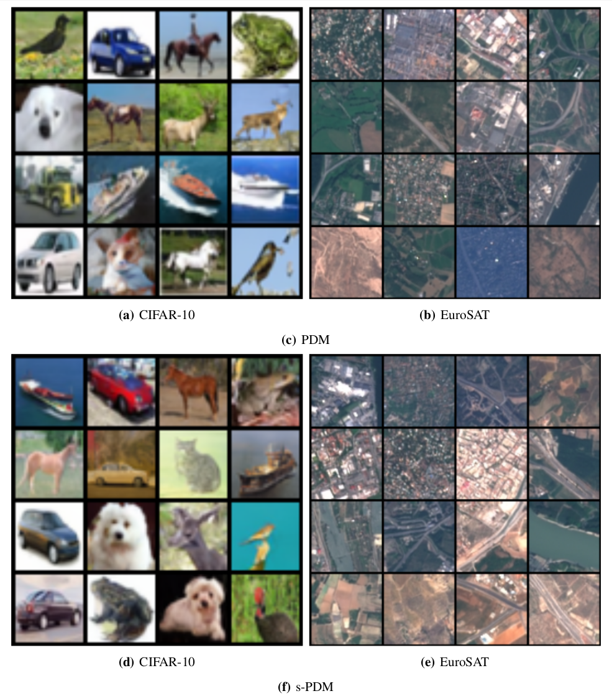

# Prototype Diffusion Model (PDM) & Supervised PDM (s-PDM)

**PDM** is a prototype-conditioned diffusion framework designed for image generation across diverse datasets.
It extends standard denoising diffusion probabilistic models (DDPM) by introducing a learned *prototype mechanism* that provides structured conditioning and improves sample quality.

We also propose **s-PDM**, a supervised variant that leverages label information to obtain even better results when annotations are available.

---

## 🚀 Key Highlights

* **PDM**: Unsupervised prototype learning, adaptable across datasets without labels.
* **s-PDM**: Supervised prototype learning, yielding higher quality but requiring labels.
* **Multi-GPU training** with Accelerate.
* **Benchmarked** on CELEBA, CIFAR-10, EuroSAT, STL-10, and Tiny ImageNet.
* **Improved IS, FID, and KID** over baselines like DDPM and ProtoDiffusion.

---

## 📦 Installation

```bash
# Clone the repository
git clone git@github.com:b-faye/pdm.git
cd pdm

# Create and activate a virtual environment
python3 -m venv .venv
source .venv/bin/activate   # On Windows: .venv\Scripts\activate

# Install dependencies
pip install -r requirements.txt
```

**Accelerate configuration**
Before training, configure Accelerate for your system:

```bash
accelerate config
```

---

## 📂 Dataset Structure

Your data directory should look like this:

```
datasets/
│
├── CELEBA/
│   ├── PDM/
│   │   └── main.py
│   └── s-PDM/
│       └── main.py
│
├── CIFAR-10/
│   ├── PDM/
│   └── s-PDM/
│
├── EuroSAT/
│   ├── PDM/
│   └── s-PDM/
│
├── STL-10/
│   ├── PDM/
│   └── s-PDM/
│
└── Tiny ImageNet/
    ├── PDM/
    └── s-PDM/
```

---

## 🏋️ Training

Example training command for **multi-GPU** using 🤗 Accelerate:

```bash
accelerate launch --multi_gpu main.py
```

### SLURM Script (2× A100)

```bash
#!/bin/bash
#SBATCH --job-name=pdm
#SBATCH --output=output.txt
#SBATCH --error=error.txt
#SBATCH --partition=GPU-A100
#SBATCH --nodes=1
#SBATCH --ntasks=2
#SBATCH --cpus-per-task=8
#SBATCH --gres=gpu:2
#SBATCH --mem=80G
#SBATCH --time=infinite

source .venv/bin/activate

export PYTORCH_CUDA_ALLOC_CONF="max_split_size_mb:512"
export NCCL_P2P_DISABLE=1
export TMPDIR=/store

accelerate launch --multi_gpu --main_process_port 29502 main.py
```

---

## 🔮 Inference

```python
def generate_and_save_images(output_dir, pipeline, accelerator, total_images=20):
    device = accelerator.device
    generated_dir = os.path.join(output_dir, "generated")
    os.makedirs(generated_dir, exist_ok=True)

    batch_size = 4
    num_batches = total_images // batch_size

    for i in tqdm(range(num_batches), desc="Generating images"):
        with torch.no_grad():
            generator = torch.Generator(device=device).manual_seed(config.seed + i)
            images = pipeline(batch_size=batch_size, image=None, output_type="pt",
                              return_dict=True, generator=generator).images
            if isinstance(images, np.ndarray):
                images = torch.from_numpy(images)
            elif isinstance(images, list) and isinstance(images[0], np.ndarray):
                images = torch.stack([torch.from_numpy(img) for img in images])

        images = images.permute(0, 3, 1, 2).cpu()
        for j in range(images.size(0)):
            index = i * batch_size + j
            save_image(images[j], os.path.join(generated_dir, f"image_{index:05d}.png"))

    print(f"Saved {total_images} generated images to {generated_dir}")
    return generated_dir
```

---

## ✨ Qualitative Results



---

## 📚 Citation

If you use this work, please cite:

```bibtex
@article{faye2025pdm,
  title={Prototype-Guided Diffusion: Visual Conditioning without External Memory},
  author={Bilal Faye and Hanane Azzag and Mustapha Lebbah},
  year={2025},
  journal={arXiv preprint},
}
```

